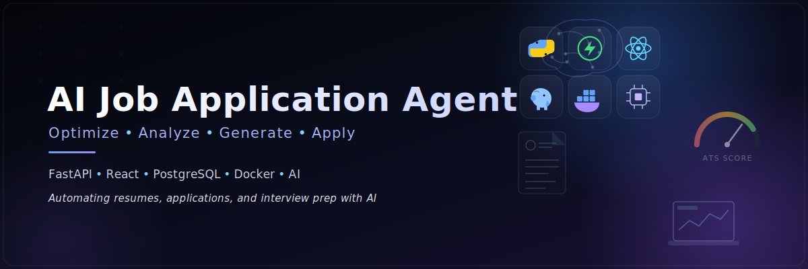

<p align="center">
  
</p>

<div align="center">


### 🚀 AI Job Application Agent

**AI-powered Resume Optimization Platform built with FastAPI, React, PostgreSQL & Docker**

</div>

---

## 📖 Overview

An AI-powered platform that helps job seekers optimize their resumes for specific job descriptions. The application analyzes ATS compatibility, rewrites resumes, generates tailored content, and provides an improved resume ready for job applications.

---

## ✨ Features

- 📄 Upload Resume (PDF)
- 🤖 AI-powered Resume Analysis
- 🎯 ATS Score Evaluation
- 📝 Resume Rewriting based on Job Description
- 📥 Download Optimized Resume
- ⚡ FastAPI REST APIs
- ⚛️ Modern React Frontend
- 🐳 Dockerized Full-Stack Deployment
- 🗄️ PostgreSQL Database

---

## 🛠 Tech Stack

### Backend
- FastAPI
- SQLAlchemy
- PostgreSQL
- Pydantic
- PyMuPDF
- Python

### Frontend
- React
- Vite
- JavaScript
- CSS

### DevOps
- Docker
- Docker Compose

---

# 📂 Project Structure

```text
AI-Job-Application-Agent
│
├── backend/
│   ├── app/
│   ├── uploads/
│   ├── requirements.txt
│   ├── Dockerfile
│   └── ...
│
├── frontend/
│   ├── src/
│   ├── public/
│   ├── Dockerfile
│   └── ...
│
├── docker-compose.yml
├── .gitignore
└── README.md
```

---

# 🚀 Getting Started

## Clone Repository

```bash
git clone https://github.com/anshuman9123/AI-Job-Application-Agent.git

cd AI-Job-Application-Agent
```

---

## Run with Docker

```bash
docker compose up --build
```

---

## Application URLs

Frontend

```
http://localhost:5173
```

Backend

```
http://localhost:8000
```

Swagger Documentation

```
http://localhost:8000/docs
```

---

# 📸 Screenshots

> Add screenshots of:

- Home Page
- Resume Upload
- ATS Analysis
- Resume Generation
- Download Resume
- Swagger API Docs

---

# 🔮 Future Improvements

- Authentication
- Multi Resume Management
- AI Cover Letter Generator
- Interview Question Generator
- Job Recommendation Engine
- Resume Version History
- Email Integration

---

# 👨‍💻 Author

**Anshuman Kumar**

GitHub:
https://github.com/anshuman9123

LinkedIn:
(Add your LinkedIn profile)

---

## ⭐ Support

If you found this project useful, consider giving it a ⭐ on GitHub.
